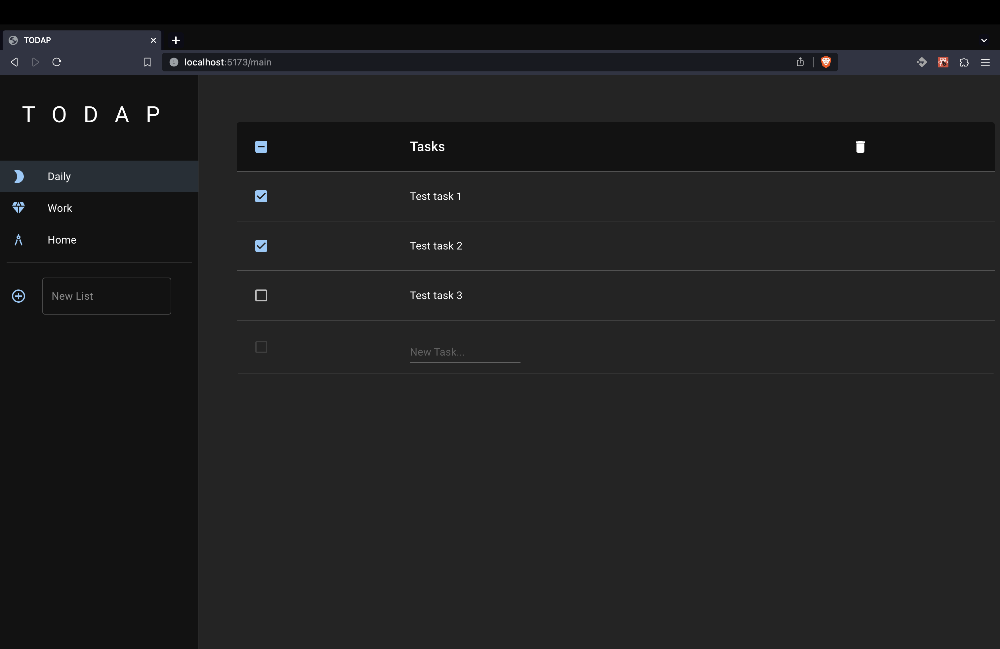

# Todapp

## What is TODAP

TODAP is a simple todo-list application created in order to get to know the basics of [React.js](https://react.dev/) aswell as different useful libraries like [ReactRouter](https://reactrouter.com/en/main), [ReactQuery](https://tanstack.com/query/latest) or the [MaterialUI](https://mui.com/).

## Screenshots

---

## Bugs:

- Clicking on a user the first time does not work

## For Version 1.1

- ~~List name for first list~~
- ~~Error handling~~
- ~~No data screen~~
- ~~Display last list after deleting list~~
- ~~Retry-Button for no Data~~
- ~~Global declareFile?~~
- ~~Use [Lodash](https://lodash.com/)~~
- ~~Use [Zustand](https://docs.pmnd.rs/zustand/getting-started/introduction)~~
- ~~Avatar Pics~~
- ~~Snackbar for more events~~
- ~~implement AddUser~~
- ~~Prettify UserSelectSkeleton~~
- ~~Prettify UserSelect~~
- Deletable Users

## For future Versions

- Different db for different Users
- Snackbar for even more events
